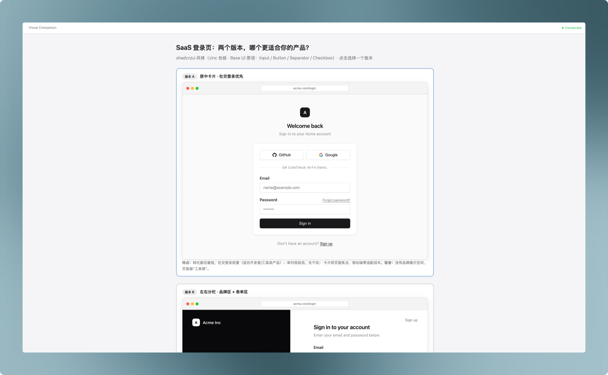

# Visual Companion

An [Agent Skill](https://skills.sh) that gives your coding agent a live browser canvas. When a discussion turns visual — mockups, layout or style comparisons, diagrams, visual hierarchy — the agent pushes interactive HTML screens to your browser instead of describing them in text, and your clicks flow back into the conversation as structured feedback.

Works with Claude Code, Codex, Copilot CLI, and other agents that support the `SKILL.md` format.

## Preview



*Output from a real session: asked to compare two SaaS login page directions, the agent renders both as high-fidelity, clickable options in the browser while the trade-off discussion stays in the conversation.*

## How it works

1. You invoke the skill during a discussion.
2. The agent starts a small local server (plain Node.js, zero dependencies) and opens your browser.
3. For each visual question, the agent writes an HTML screen (wireframe, comparison, diagram) into the session directory; the browser updates live over WebSocket.
4. You click options in the browser and/or reply in the conversation. Click events are recorded as JSON Lines and merged with your conversational feedback.
5. Text questions stay in the conversation; the browser shows a waiting screen until the next visual question.

All session artifacts live under `<project>/.mockup/<session-id>/` in your project — the skill directory itself stays read-only.

## Installation

### Via [skills.sh](https://skills.sh) (recommended)

```bash
npx skills add socekin/Visual-Companion
```

### Manual (Claude Code)

```bash
git clone https://github.com/socekin/Visual-Companion.git ~/.claude/skills/visual-companion
```

Other agents: clone the repository into your agent's skills directory (e.g. `.agents/skills/`, `.cursor/skills/`).

## Requirements

- Node.js 18+
- Bash (macOS, Linux, or Windows Git Bash)
- A local browser

## Usage

Invoke the skill explicitly when you want a visual session (it does not auto-trigger):

```
/visual-companion Let's compare layout options for the dashboard
```

The agent will:

- start one browser session for the whole discussion,
- route visual questions to the browser and conceptual questions to the conversation,
- present 2–4 clickable options when a comparison helps,
- keep the browser in sync with the current phase of the discussion.

Close the session by telling the agent you're done; generated screens are preserved under `.mockup/`.

### Notes

- `.mockup/` embeds the session key. The skill checks that it is ignored by version control and offers to add an ignore rule if not.
- The server binds to loopback (`127.0.0.1`) by default and authorizes access with a per-session key. For remote or containerized environments, see the platform notes in [visual-guide.md](visual-guide.md).
- The server shuts down automatically after 4 idle hours (configurable via `--idle-timeout-minutes`).

## Repository layout

```
SKILL.md          # Skill entry point: the operational loop
visual-guide.md   # Content and interaction contract for browser screens
scripts/
  start-server.sh # Start a session server
  stop-server.sh  # Stop a session server
  server.cjs      # Zero-dependency HTTP + WebSocket server
  frame-template.html
  helper.js       # Injected browser-side interaction API
```

## Acknowledgments

This skill is extracted from the visual companion component of the **brainstorming** skill in [Superpowers](https://github.com/obra/superpowers) by Jesse Vincent. Superpowers is a fantastic collection of agent skills — go check it out. All credit for the original design and server implementation belongs to the Superpowers project.

## License

[MIT](LICENSE) — portions Copyright (c) 2025 Jesse Vincent (from [Superpowers](https://github.com/obra/superpowers), MIT licensed).
